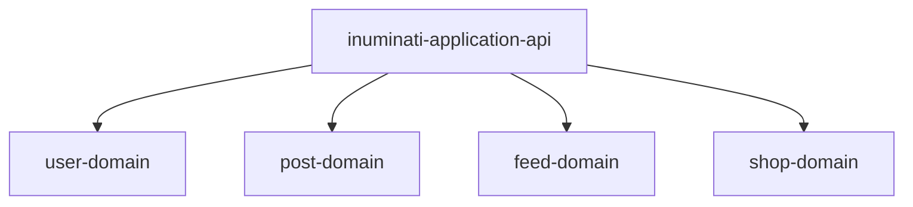

# Inuminati Api

## モジュール構成

| モジュール名              | 概要                                       |
| ------------------------- | ------------------------------------------ |
| inuminati-application-api | inuminati-webからのリクエストを受け付ける |
| user-domain               | ユーザーのフォローやDMを管理             |
| post-domain               | 投稿の管理                                 |
| feed-domain               | ユーザーにおすすめを表示                   |
| shop-domain               | ショップ関連                               |
| inuminati-common          | その他共通モジュール                       |
| inuminati-core            | 犬をスクレイピングする                     |

